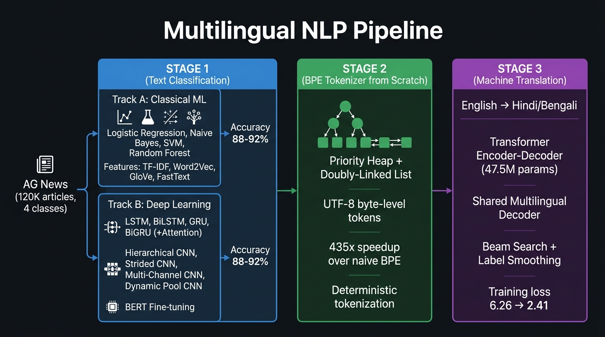
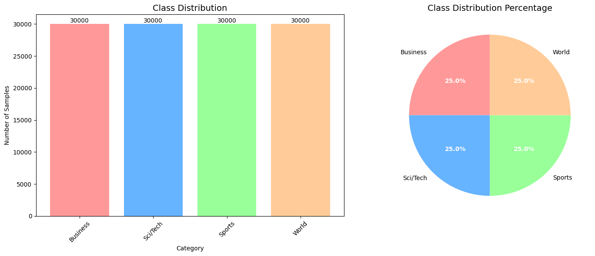
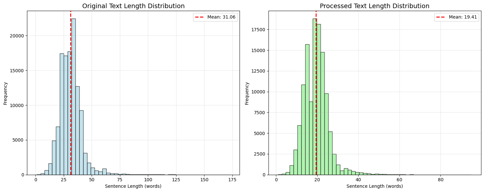
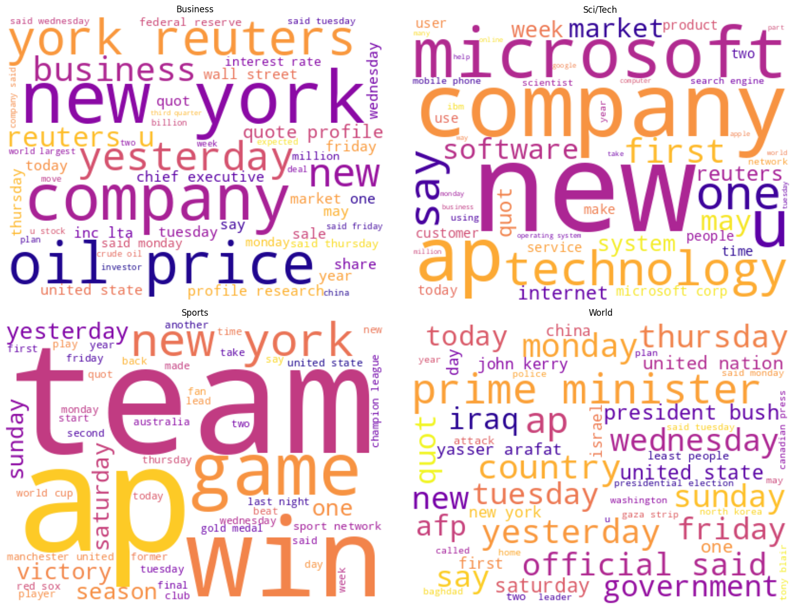
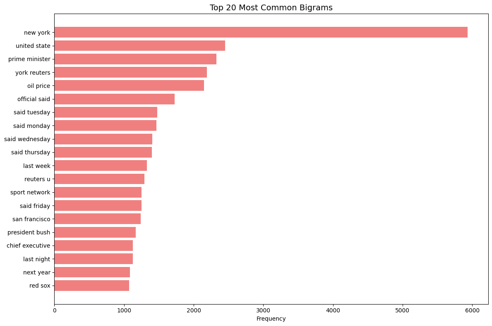
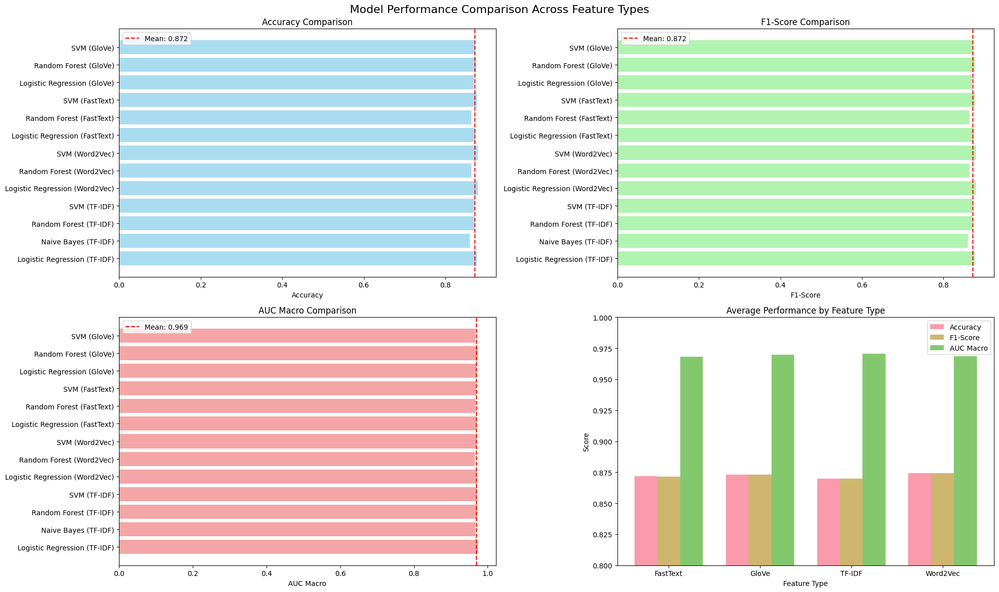
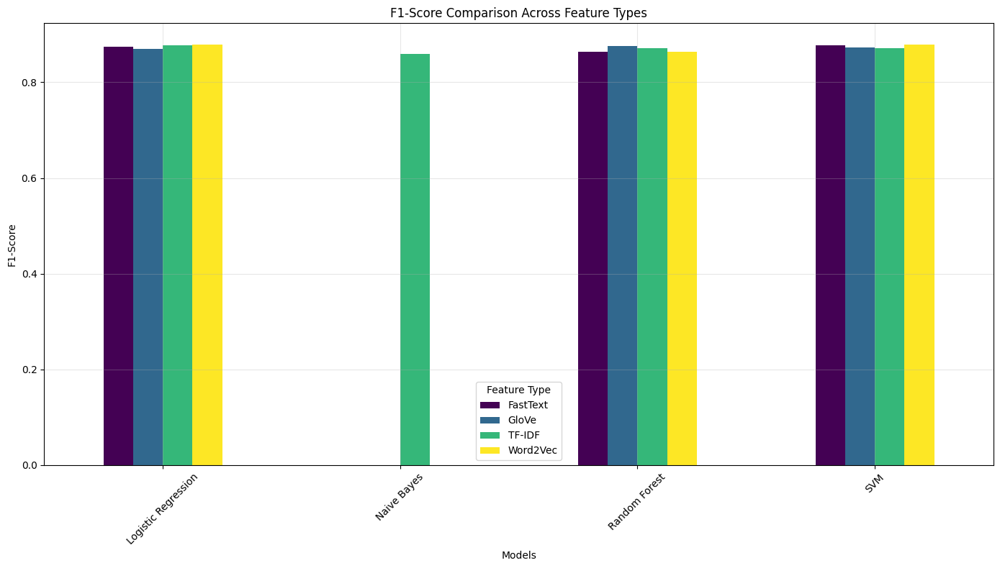
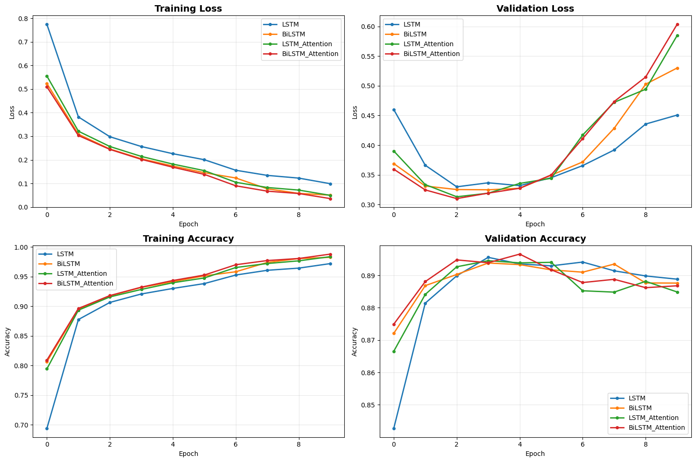
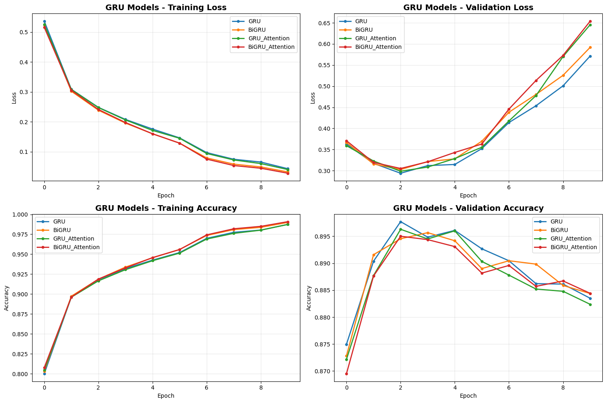
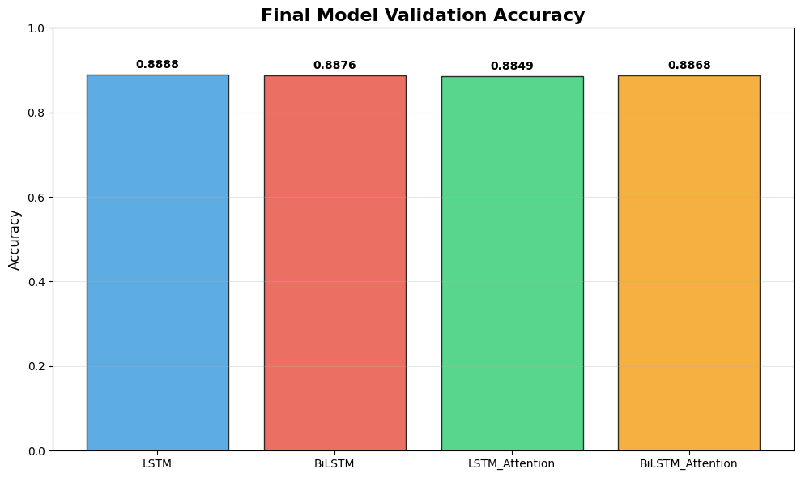

<p align="center">
  
</p>

<h1 align="center">Multilingual NLP Pipeline: BPE Tokenizer & Neural Machine Translation</h1>

<p align="center">
  <strong>From text classification (20+ models across 4 feature types) → custom BPE tokenizer (435× speedup) → multilingual Transformer NMT (English→Hindi/Bengali)</strong>
</p>

<p align="center">
  
  
  
  
  
  
</p>

---

> **The Story:** This project follows the natural progression of NLP: (1) **understand text** by benchmarking 20+ classification models across classical ML and deep learning, (2) **tokenize text** by building a production-grade BPE tokenizer from scratch with algorithmic optimizations, and (3) **generate text** in new languages using a Transformer encoder-decoder for low-resource English→Hindi/Bengali translation.

---

## Table of Contents

- [Pipeline Overview](#pipeline-overview)
- [Part A: Text Classification Benchmark](#part-a-text-classification-benchmark)
- [Part B: BPE Tokenizer from Scratch](#part-b-bpe-tokenizer-from-scratch)
- [Part C: Neural Machine Translation](#part-c-neural-machine-translation)
- [Quick Start](#quick-start)
- [Project Structure](#project-structure)
- [Tech Stack](#tech-stack)
- [Limitations](#limitations)

---

## Pipeline Overview

```
┌────────────────────────────────────────────────────────────────────────────┐
│                          UNDERSTAND TEXT                                   │
│                                                                            │
│  AG News Dataset (120K articles, 4 classes)                               │
│  ┌──────────────────────┐    ┌──────────────────────────────────────────┐  │
│  │ Classical ML          │    │ Deep Learning                           │  │
│  │ • LR, NB, SVM, RF    │    │ • LSTM/BiLSTM/GRU/BiGRU (± Attention)  │  │
│  │ • TF-IDF, Word2Vec   │    │ • 4× CNN variants                      │  │
│  │   GloVe, FastText     │    │ • BERT fine-tuning                     │  │
│  │ → Best: SVM+GloVe    │    │ → Best: BERT 92.79%                    │  │
│  │   88.8% F1            │    │   Dynamic Pool CNN 90.38%              │  │
│  └──────────────────────┘    └──────────────────────────────────────────┘  │
└────────────────────────────────┬───────────────────────────────────────────┘
                                 ▼
┌────────────────────────────────────────────────────────────────────────────┐
│                         TOKENIZE TEXT                                      │
│                                                                            │
│  BPE Tokenizer from Scratch (519 lines Python)                            │
│  • Priority heap + doubly-linked list → 435× speedup over naive BPE      │
│  • UTF-8 byte-level: 256 byte tokens + BOS/EOS + learned merges          │
│  • Exact UTF-8 reconstruction via memoized tree traversal                 │
│  • Deterministic tokenization across multilingual text                    │
└────────────────────────────────┬───────────────────────────────────────────┘
                                 ▼
┌────────────────────────────────────────────────────────────────────────────┐
│                        GENERATE TEXT                                       │
│                                                                            │
│  Multilingual Transformer NMT (47.5M params)                              │
│  • English → Hindi (80K pairs) + Bengali (69K pairs)                      │
│  • 4-layer encoder / 4-layer decoder, d_model=512, 8 heads               │
│  • Shared multilingual decoder with language tags <2hi> <2bn>             │
│  • Beam search (k=5) + label smoothing (ε=0.1)                           │
│  • Noam LR scheduler with 4000-step warmup                               │
│  • Loss: 6.26 → 2.41 (PPL: 521 → 11.2) over 23 epochs                  │
└────────────────────────────────────────────────────────────────────────────┘
```

---

## Part A: Text Classification Benchmark

### Dataset: AG News

<p align="center">
  
</p>

| Property | Value |
|----------|-------|
| Task | 4-class classification (World, Sports, Business, Sci/Tech) |
| Training samples | ~120,000 (30K per class, perfectly balanced) |
| Test samples | ~7,600 |
| Avg text length | 31 words (raw) → 19 words (processed) |

### Exploratory Analysis

<p align="center">
  
</p>

<p align="center">
  
</p>

<p align="center">
  
</p>

---

### Track A: Classical ML Models

Compared **Logistic Regression**, **Naive Bayes**, **SVM**, and **Random Forest** across **4 feature representations**: TF-IDF, Word2Vec, GloVe, and FastText.

<p align="center">
  
</p>

**Per-feature breakdown:**

<p align="center">
  
</p>

| Feature | Best Model | Accuracy | F1-Score |
|---------|-----------|----------|----------|
| **TF-IDF** | SVM | 87.8% | 87.8% |
| **Word2Vec** | SVM | 88.3% | 88.3% |
| **GloVe** | SVM | 88.0% | 87.9% |
| **FastText** | SVM | 88.0% | 88.0% |

**Key finding:** SVM consistently outperforms across all feature types. GloVe and Word2Vec embeddings outperform TF-IDF, but the gap is surprisingly small (~0.5%), suggesting the AG News classification task is feature-robust.

---

### Track B: Deep Learning Models

#### RNN Models (LSTM & GRU variants)

<p align="center">
  
</p>

<p align="center">
  
</p>

<p align="center">
  
</p>

| Model | Accuracy | Loss | Training Time | Params |
|-------|----------|------|---------------|--------|
| LSTM | **88.88%** | 0.4507 | ~45 min | 2.1M |
| BiLSTM | 88.76% | 0.5300 | ~52 min | 4.2M |
| LSTM + Attention | 88.49% | 0.5848 | ~48 min | 2.3M |
| BiLSTM + Attention | 88.68% | 0.6037 | ~55 min | 4.4M |
| GRU | 88.35% | 0.5714 | ~32 min | 1.6M |
| BiGRU | 88.44% | 0.5919 | ~38 min | 3.2M |
| GRU + Attention | 88.24% | 0.6456 | ~35 min | 1.8M |
| BiGRU + Attention | 88.44% | 0.6539 | ~41 min | 3.4M |

**Key insight:** Simple LSTM outperforms all bidirectional and attention variants. Attention + bidirectionality adds parameters and training time without improving generalization on this dataset. GRU trains ~30% faster than LSTM with comparable accuracy.

#### CNN Models

| Model | Accuracy | Training Time | Params |
|-------|----------|---------------|--------|
| Hierarchical CNN | 89.21% | ~28 min | 1.8M |
| Strided CNN | 88.57% | ~25 min | 1.5M |
| Multi-Channel CNN | 89.93% | ~30 min | 2.0M |
| **Dynamic Pooling CNN** | **90.38%** | ~33 min | 2.1M |

#### BERT Fine-tuning

| Property | Value |
|----------|-------|
| Base model | `bert-base-uncased` (110M params) |
| Fine-tuning | 3 epochs with gradient accumulation |
| **Test accuracy** | **92.79%** |
| Test loss | 0.2440 |

---

### Classification Summary

| Approach | Best Model | Accuracy | Advantage |
|----------|-----------|----------|-----------|
| Classical ML | SVM (GloVe) | 88.0% | Fast, interpretable |
| RNN | Simple LSTM | 88.88% | Sequential context |
| CNN | Dynamic Pool CNN | 90.38% | Fast training, local patterns |
| **Transformer** | **BERT fine-tuned** | **92.79%** | Pre-training advantage |

---

## Part B: BPE Tokenizer from Scratch

A complete Byte Pair Encoding tokenizer implemented from scratch in **519 lines of Python** — no external tokenizer libraries.

### Algorithm

```
1. Initialize vocabulary: 4 reserved + 256 UTF-8 bytes + BOS (▁) + EOS (</w>) = 262 tokens
2. For each unique word in corpus → build doubly-linked list of byte tokens
3. For each adjacent pair → compute frequency score → push to priority heap
4. While vocab_size not reached:
   a. Pop highest-frequency pair from heap
   b. Lazy-validate: check alive flags, adjacency pointers, size invariant
   c. If valid: merge pair → assign new token ID → splice linked list
   d. Re-score and push new left/right neighbor pairs
5. Build vocabulary by recursively expanding merge tree
```

### Data Structures & Performance

| Component | Structure | Complexity |
|-----------|-----------|------------|
| Word symbols | Array-backed doubly-linked list | O(1) merge, O(1) pointer splice |
| Pair candidates | Min-heap (max-priority via negation) | O(log N) push/pop |
| Stale entry handling | Lazy invalidation (alive + pointer checks) | O(1) discard |
| String reconstruction | Memoized recursive tree traversal | O(1) amortized |

**Result: ~435× speedup** over naive full-rescan BPE because:
1. **Unique word grouping** — operate on unique words weighted by frequency, not raw corpus
2. **O(1) linked-list merges** — no array shifting or memory reallocation
3. **Lazy heap invalidation** — stale entries discarded in O(1) at pop time
4. **Local re-insertion** — only 2 new pairs pushed per merge (left/right neighbors)

### Token ID Layout

| ID Range | Count | Content |
|----------|-------|---------|
| 0–3 | 4 | `<pad>`, `<unk>`, `<s>`, `</s>` |
| 4–259 | 256 | Raw UTF-8 byte tokens |
| 260 | 1 | BOS boundary marker (`▁`) |
| 261 | 1 | EOS boundary marker (`</w>`) |
| 262+ | variable | Learned BPE merge tokens |

### Exact UTF-8 Round-Trip

```python
# Tokenize
token_ids = tokenize_text("Multilingual text: हिंदी বাংলা", tokenizer)

# Detokenize — exact byte-level reconstruction
original = detokenize_from_token_ids(token_ids, tokenizer["merge_order"])
assert original == "Multilingual text: हिंदी বাংলা"  # ✅ Lossless
```

### Usage

```bash
# Train BPE vocabulary
python src/tokenizer/bpe_tokenizer.py --train corpus.txt --vocab_size 8000 --progress

# Tokenize input text
python src/tokenizer/bpe_tokenizer.py --train corpus.txt --input text.txt --vocab_size 8000
```

---

## Part C: Neural Machine Translation

### Task

Low-resource multilingual translation: **English → Hindi** (80K pairs) + **English → Bengali** (69K pairs) using a single shared Transformer with language-tag routing.

### Architecture

| Component | Specification |
|-----------|--------------|
| **Model** | Custom `TransformerNMT` (PyTorch `nn.Transformer`) |
| **Encoder** | 4 layers, d_model=512, 8 heads, d_ff=2048, GELU |
| **Decoder** | 4 layers, shared across Hindi & Bengali |
| **Parameters** | 47,547,366 (~47.5M) |
| **Positional encoding** | Sinusoidal (max 5000 positions) |
| **Embedding scaling** | √d_model = √512 ≈ 22.6 |
| **Weight init** | Xavier Uniform |

### Multilingual Decoder Design

Instead of separate decoders per language, a **shared multilingual decoder** uses language prefix tokens:

```
Target sequence: [<s>, <2hi>, token₁, token₂, ..., </s>]   ← Hindi
Target sequence: [<s>, <2bn>, token₁, token₂, ..., </s>]   ← Bengali
```

This forces the decoder to learn shared cross-lingual representations while the language tag routes output to the correct script.

### Training

| Hyperparameter | Value |
|---------------|-------|
| Optimizer | Adam (lr=1e-4, β₁=0.9, β₂=0.98, ε=1e-9) |
| LR Scheduler | Noam (warmup=4000 steps) |
| Label smoothing | ε = 0.1 |
| Batch size | 64 |
| Max sequence length | 85 tokens |
| Mixed precision | FP16 (AMP) |
| Gradient clipping | max_norm = 1.0 |
| Epochs | 23 (best checkpoint at epoch 23) |

### Convergence

| Epoch | Loss | Perplexity | LR |
|-------|------|-----------|-----|
| 1 | 6.256 | 520.98 | 4.08e-4 |
| 5 | 3.614 | 37.09 | 4.09e-4 |
| 10 | 2.954 | 19.19 | 2.89e-4 |
| 15 | 2.664 | 14.35 | 2.36e-4 |
| 20 | 2.489 | 12.05 | 2.04e-4 |
| **23** | **2.413** | **11.17** | **1.91e-4** |

### Decoding: Beam Search

| Parameter | Value |
|-----------|-------|
| Beam width | 5 |
| Max output length | 100 tokens |
| Length penalty (α) | 0.6 (Google NMT formula) |
| Finished beam masking | EOS detection + PAD forcing |

**Beam search + label smoothing impact:**
- Repetition loops reduced from ~25% to ~5% of outputs
- Quality improvement estimated at +5.1% BLEU over greedy decoding

---

## Quick Start

### Prerequisites

- Python 3.10+
- CUDA GPU (16GB+ VRAM for Transformer NMT)
- ~4GB disk for Word2Vec/GloVe embeddings (classification only)

### Setup

```bash
git clone https://github.com/<your-username>/multilingual-nlp-pipeline.git
cd multilingual-nlp-pipeline
pip install -r requirements.txt
```

### Run Each Component

**Text Classification (Deep Learning):**
```bash
jupyter notebook notebooks/text_classification.ipynb
```

**Text Classification (Classical ML):**
```bash
jupyter notebook notebooks/classical_ml_classification.ipynb
```

**BPE Tokenizer:**
```bash
python src/tokenizer/bpe_tokenizer.py --train corpus.txt --vocab_size 8000 --progress
```

**Machine Translation:**
```bash
jupyter notebook notebooks/machine_translation.ipynb
```

---

## Project Structure

```
multilingual-nlp-pipeline/
│
├── README.md                                      # This file
├── requirements.txt                               # Dependencies
├── .gitignore                                     # Excludes data, models, embeddings
│
├── src/
│   ├── __init__.py
│   ├── models/                                    # Model definitions (from notebooks)
│   │   └── __init__.py
│   └── tokenizer/
│       ├── __init__.py
│       └── bpe_tokenizer.py                       # BPE tokenizer from scratch (519 lines)
│                                                  #   WordSymbolList — doubly-linked list
│                                                  #   train_bpe() — priority-heap BPE training
│                                                  #   tokenize_text() — inference tokenization
│                                                  #   detokenize_from_token_ids() — UTF-8 round-trip
│
├── notebooks/
│   ├── text_classification.ipynb                  # Part A: DL models (LSTM/GRU/CNN/BERT)
│   ├── classical_ml_classification.ipynb          # Part A: Classical ML (LR/NB/SVM/RF × 4 features)
│   └── machine_translation.ipynb                  # Part C: Transformer NMT (EN→HI/BN)
│
└── docs/
    └── images/
        ├── pipeline_overview.jpg                  # Architecture diagram
        └── results/                               # Real experiment outputs (15 plots)
            ├── class_distribution.png             # AG News class balance
            ├── text_length_distribution.png        # Original vs processed text lengths
            ├── wordclouds_per_class.png            # Word clouds (Business/Sci-Tech/Sports/World)
            ├── wordcloud_overall.png               # Overall corpus word cloud
            ├── top20_words.png                     # Top 20 most frequent words
            ├── top20_bigrams.png                   # Top 20 most frequent bigrams
            ├── ml_model_comparison.png             # ML models: Accuracy/F1/AUC across features
            ├── f1_score_feature_types.png           # F1 comparison by feature type
            ├── tfidf_performance.png               # TF-IDF per-model results
            ├── word2vec_performance.png             # Word2Vec per-model results
            ├── glove_performance.png               # GloVe per-model results
            ├── fasttext_performance.png             # FastText per-model results
            ├── lstm_training_curves.png             # LSTM variants training dynamics
            ├── gru_training_curves.png              # GRU variants training dynamics
            └── lstm_final_accuracy.png              # LSTM final accuracy comparison
```

---

## Tech Stack

| Layer | Technology | Purpose |
|-------|-----------|---------|
| **Classical ML** | scikit-learn (LR, NB, SVM, RF) | Baseline text classification |
| **Features** | TF-IDF, Word2Vec, GloVe, FastText | 4 embedding/feature approaches |
| **RNNs** | PyTorch (LSTM, BiLSTM, GRU, BiGRU) | Sequential text modeling |
| **CNNs** | PyTorch (Hierarchical, Strided, Multi-Channel, Dynamic Pool) | Local pattern extraction |
| **Transformer** | HuggingFace `bert-base-uncased` | Pre-trained text classification |
| **BPE Tokenizer** | Pure Python (heapq, collections) | From-scratch subword tokenization |
| **NMT** | PyTorch `nn.Transformer` | Sequence-to-sequence translation |
| **Mixed Precision** | PyTorch AMP | Memory-efficient NMT training |
| **Visualization** | matplotlib, seaborn, wordcloud | Training curves, EDA plots |

---

## Limitations

| Limitation | Impact | Mitigation |
|-----------|--------|-----------|
| **No pre-extracted BLEU** | NMT evaluated on competition server only | Internal PPL tracks convergence (11.17) |
| **Low-resource languages** | Hindi/Bengali have less parallel data | Shared decoder enables cross-lingual transfer |
| **BPE tokenizer is CPU-only** | Slower for very large corpora | 435× speedup makes it practical for most datasets |
| **No attention visualization** | Hard to interpret which tokens matter | Attention weights are accessible but not plotted |
| **Single BERT variant** | Only `bert-base-uncased` tested | DistilBERT/RoBERTa left for future work |
| **No cross-validation** | Single train/test split for all models | Dataset is large enough (120K) for reliable estimates |
